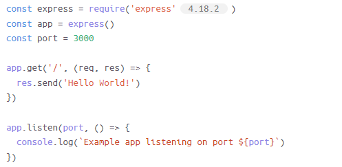

# node-express-hello-world-project

- **Deoj Balcanao**

- **CPNT 201 Achievements Round 2 - NPM**

## Process
1. **First I created a directory named myapp**

    $mkdir myapp
  
2. **Run npm init to create a package.json file**

    $ npm init
  
3. **Install express as a dependancy**

    $ npm install express
  
4. **Created a file named app.js in the myapp directory**

    $ touch app.js
  
5. **Then I added this code to app.js**

    

6. **Run the app**

    $ node app.js
  
7. **Then I load this url in the browser**

    http://localhost:3000/

8. **Browser output**

    
